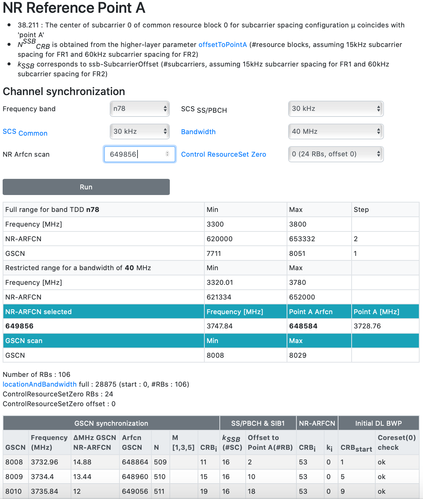
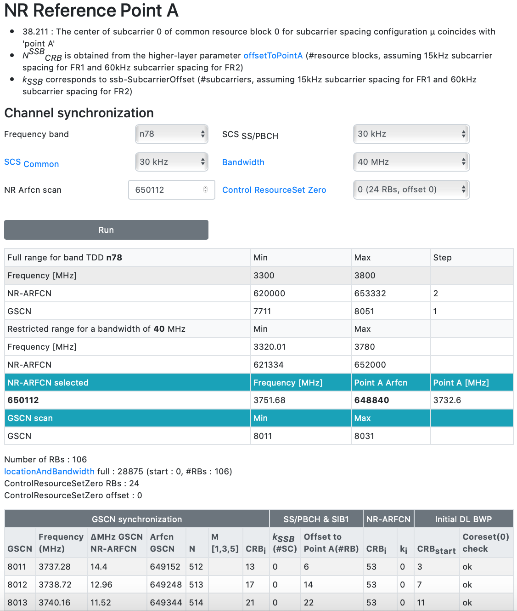
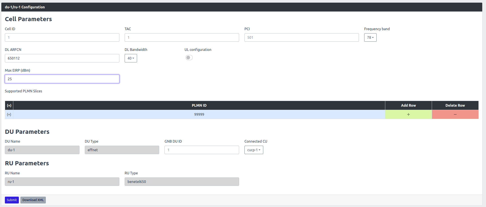

# DU/RU Configuration

This section is exclusively applicable to the user/customer that intends to use the Benetel RAN550 or RAN650 Radio End with our Accellleran 5G end to end solution, if you do not have such radio end the informations included in this section may be misleading and bring to undefined error scenarios. Please contact Accelleran if your Radio End is not included in any section of this user guide.

## 1. Parameter Configuration

### 1.1. Configuring Center Frequency

#### 1.1.1. Finding a Proper Frequency

There are several limitations on the Frequencies that can be selected:

- The selected frequency should be within the band supported by the hardware (RAN650/RAN550) used. 
- The selected frequency must be divisible by 3.84
- Subcarrier Spacing = 30KHz
- Bandwidth = 40MHz or 100MHz
- The K_ssb must be 0
- The offset to point A must be 6

Let's proceed with an example:

To set a center frequency of 3750 MHz, this is not divisible by 3.84, the nearest frequencies that meet this condition are 3747.84MHz (976*3.84) 3751.68MHz (977*3.84) so let's consider first 3747,84 MHz and verify the conditions on the K_ssb and Offset to Point A with this online tool (link at:  (https://www.sqimway.com/nr_refA.php) ).

- On the tool set the Band to 78, SCS to 30KHz, the Bandwidth to 40MHz and the ARFCN of the center frequency 3747,84 which is 649856 and when we hit the **RUN** button we obtain:

<p align="center">
  
</p>

This Frequency, however does not meet the **GSCN Synchronisation requirements** as in fact the Offset to Point A of the first channel is 2 and the K_ssb is 16, this will cause the UE to listen on the wrong channel so the SIBs will never be seen and therefore the cell is "invisible".

- We then repeat the exercise with the higher center frequency 3751.68MHz, which yelds a center frequency ARFCN of 650112 and a point A ARFCN of 648840 and giving another run we will see that now the K_ssb and the Offset to Point A are correct.

<p align="center">
  
</p>

#### 1.1.2. Applying The Frequency Change

(Through the cell wrapper)
- From the dashboard go to "RAN Overview" then "5G"
- From the DU/RU list, find the cell to be changed and Click on "configuration".
- For our example where the center frequency required is 3751.68MHz which is ARFCN 650112. Fill that in the "DL ARFCN" and click submit.
- This will reboot the RU and the DU and the change would take effect.

<p align="center">
  
</p>


### 1.2. Configuring Cell TX Power

By default RAN650 is configured with 35dBm and RAN550 is configured with 25dBm.

(Through the cell wrapper)

- From the dashboard go to "RAN Overview" then "5G"
- From the DU/RU list, find the cell to be changed and Click on "configuration".
- For our the new output power is 25dBm. Fill that in the "Max EIRP (dBm)" and click submit.
- This will reboot the RU and the DU and the change would take effect.

<p align="center">
  
</p>

## 2. Checking RU Status

After applying actions on the RU to change the frequency or the power. A reboot of the RU is necessary and will be applied via the cell wrapper when clicking **submit**.

Below are some useful checks to confirm the status of the RU after the reboot.

- The RU Synchrnoization status can be checked by running below command on the RU.

```syncmon```

- The RAN650 or RAN550 units usually take from 4~6 mins to boot up after a power cycle. The status of the RU boot up will be printed in a file during boot up. It can be checked by: 

```tail -F /tmp/logs/radio_status```